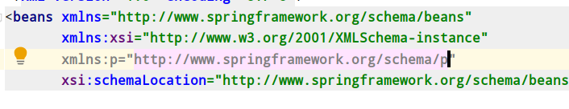

# IOC(容器)

> IOC（控制反转）

## 什么是IOC

1. 控制反转，把对象的创建和对象之间的调用过程，交给Spring进行管理。
2. 使用IOC目的：为了耦合度降低
3. 做入门的案例就是IOC实现

## IOC底层原理

1. xml解析、工厂模式、反射

## 画图讲解IOC底层原理


# IOC（接口）

1. IOC 思想基于IOC容器完成，IOC容器底层就是对象工厂。
2. Spring提供IOC容器实现两种方式：（两个接口）。
   1. BeanFactor：IOC容器基本实现，（开发中一班不使用），是Spring内部的使用接口，不提供开发人员进行使用
      + 加载配置文件的使用，不会创建里边的对象，在使用的时候才会去创建（懒汉式）
   2. ApplicationContext：BeanFactor接口的子接口，提供更多强大的功能，一般由开发人员进行使用
      + 加载配置文件的时候就会把在配置文件中的对象进行创建。（饿汉式）

3. ApplicationContext接口有一些主要的实现类。


+ FileSystemXmlApplicationContext：从系统文件中加载
+ ClassPathXmlApplicationContext：从项目中加载配置文件

# IOC操作Bean管理（概念）

## 什么是Bean管理

0. Bean管理指的是两个操作

1. Spring创建对象
2. Spring注入对象

## Bean管理操作有两种方式

1. 基于XML配置文件方式进行实现
2. 基于注解方式实现

# IOC操作Bean管理（基于XML方法）

1. #### 基于xml方式创建对象

   + ```xml
     <!--配置User对象-->
     <bean id="user" class="com.zh.spring5.User"></bean>
     ```

   + 在Spring配置文件中，使用bean标签，标签里面添加对应属性，就可以实现对象创建。
   + 在bean标签中具有很多属性：
     + id属性：唯一标识，也就是你写的名称
     + class属性：类的全路径（包和类的路径）
     + name属性：作用跟id是一样的，name中可以有其他字符。
   + 创建对象的时候，默认执行无参构造器

2. #### 基于xml方式注入属性

   + DI：依赖注入，就是注入属性

3. #### 第一种注入方式：使用set方法来进行注入
   
     + ```java
       public class Book {
       
           private String bname;
       
           /**
            * set方法注入
            * @param bname
            */
           public void setBname(String bname) {
               this.bname = bname;
           }
    }
	  ```
    
   + 在Spring配置我呢见配置对象创建，配置属性注入
   
   + ```xml
         <!--1. 配置User对象-->
         <bean id="user" class="com.zh.spring5.User"></bean>
     
         <!--2. set方法注入属性-->
         <bean id="book" class="com.zh.spring5.Book">
             <!--
                 在bean标签里边使用property完成睡醒注入
                 name：类里边属性名称
                 value：向属性注入的值
             -->
             <property name="bname" value="易筋经"></property>
             <property name="bauthor" value="达摩老祖"></property>
         </bean>
     ```
   
   
   
4. #### 第二种注入方式：使用有参构造注入

  1. 创建一个类，定义属性，创建属性对应的构造参数方法

  + ```java
     public class Book {

         private String bname;
         /**
          * 使用有参构造
          * @param bname
            */
         public Book(String bname) {
             this.bname = bname;
         }
     }
     ```

  2. 在Spring配置文件中进行配置

  + ```xml
    <bean id="orders" class="com.zh.spring5.Orders">
        <constructor-arg name="oname" value="电脑"></constructor-arg>
        <constructor-arg name="address" value="China"></constructor-arg>
    <!--        <constructor-arg index="0" value="笔记本"></constructor-arg>-->
    </bean>
    ```

5. #### p名称空间注入

   1. 使用p名称空间注入，它是可以简化基于xml配置方法

   2. 第一步添加P名称空间

   3. ```java
      <bean id="book" class="com.zh.spring5.Book" p:bname="九阳神功" p:bauthor="wumignshi"></bean>
      ```

# IOC 操作bean管理（xml注入其他类型属性）

## 字面量

1. null值

   ```xml
   <!--null值-->
   <property name="address">
       <null></null>
   </property>
   ```

   

2. 属性值包含特殊字符

   ```xml
   <!--属性值中包含特殊符号
       1. 把<>进行转义 &lt;&gt;
       2. 把待特殊符号内容写到CDATA
   -->
   <property name="address">
       <value>
           <![CDATA[<<南京>>]]]>
       </value>
   </property>
   ```

## 注入属性-外部bean

1. 创建两个类service类和dao类
2. 在service调用dao的操作
3. 在配置文件中进行配置

```java
public class UserService {

    // 创建UserDao类型属性，生成set方法
    private UserDao userDao;

    public void setUserDao(UserDao userDao) {
        this.userDao = userDao;
    }

    public void add() {
        System.out.println("service add >>>>>");
        userDao.update();

        // 原始方式：创建UserDao对象
        //UserDao userDao = new UserDaoImpl();
        //userDao.update();
    }

}
```


```xml
    <!--1. service和dao对象进行创建-->
    <bean id="userService" class="com.zh.spring5.service.UserService">
        <!--注入userDao对象
            name属性值，类里边的名称
        -->
        <property name="userDao" ref="userDao"></property>
    </bean>

    <bean id="userDao" class="com.zh.spring5.dao.UserDaoImpl"></bean>
```


## 注入属性-内部bean和级联赋值

1. 一对多的关系：部门和员工
2. 在实体类之间表示一对多的关系

```java
// 部门类
public class Dept {
    private String dname;

    public void setDname(String dname) {
        this.dname = dname;
    }
}
```

```java
// 员工类
public class Emp {
    private String ename;
    private String gender;
    // 员工属于某一个部门，使用对象形式表示
    private Dept dept;

    public void setEname(String ename) {
        this.ename = ename;
    }

    public void setGender(String gender) {
        this.gender = gender;
    }
    
    public void setDept(Dept dept) {
        this.dept = dept;
    }
}
```

3. 在spring配置对象中进行配置

```xml
<!--内部bean-->
<bean id="emp" class="com.zh.spring5.bean.Emp">
    <!--设置两个普通的属性-->
    <property name="ename" value="lucy"></property>
    <property name="gender" value="女"></property>
    <!--设置对象类型属性-->
    <property name="dept" >
        <bean id="dept" class="com.zh.spring5.bean.Dept">
            <property name="dname" value="hr"></property>
        </bean>
    </property>
</bean>
```

4. 注入属性和级联赋值

第一种写法

```xml
<!--级联赋值-->
<bean id="emp" class="com.zh.spring5.bean.Emp">
    <!--设置两个普通的属性-->
    <property name="ename" value="lucy"></property>
    <property name="gender" value="女"></property>
    <!--级联赋值-->
    <property name="dept" ref="dept"></property>
</bean>
<bean id="dept" class="com.zh.spring5.bean.Dept">
    <property name="dname" value="hr"></property>
</bean>
```

第二种写法

这儿的级联赋值需要得给Emp中的dept增加get方法才可以级联赋值

```xml
<!--级联赋值-->
<bean id="emp" class="com.zh.spring5.bean.Emp">
    <!--设置两个普通的属性-->
    <property name="ename" value="lucy"></property>
    <property name="gender" value="女"></property>
    <!--级联赋值-->
    <property name="dept" ref="dept"></property>
    <property name="dept.dname" value="hrs"></property>
</bean>
<bean id="dept" class="com.zh.spring5.bean.Dept">
    <property name="dname" value="hr"></property>
</bean>
```

# IOC操作Bean管理（XML注入集合属性）

1. 注入数组类型属性

2. 注入List集合类型属性

3. 注入Map集合类型属性

**创建类，定义数组，list,map,set类型属性，生成对应set方法**

```java
public class Stu {
    // 1. 数组类型属性
    private String[] courses;

    // 2.list集合类型属性
    private List<String> list;

    // 3. map集合类型属性
    private Map<String,String> maps;

    // 4. set类型的数据
    private Set<String> sets;

    public void setCourses(String[] courses) {
        this.courses = courses;
    }

    public void setList(List<String> list) {
        this.list = list;
    }

    public void setMaps(Map<String, String> maps) {
        this.maps = maps;
    }

    public void setSets(Set<String> sets) {
        this.sets = sets;
    }

    public void test() {
        System.out.println(Arrays.toString(courses));
        System.out.println(list);
        System.out.println(maps);
        System.out.println(sets);
    }
}
```

**在Spring文件中进行配置**

```xml
<bean id="stu" class="com.zh.spring5.collectionType.Stu">
    <!--数组类型属性注入-->
    <property name="courses">
        <array>
            <value>java课程</value>
            <value>数据库课程</value>
        </array>
    </property>
    <!--list类型属性注入-->
    <property name="list">
        <list>
            <value>张三</value>
            <value>小三</value>
        </list>
    </property>
    <!--map类型属性注入-->
    <property name="maps">
        <map>
            <entry key="JAVA" value="java"></entry>
            <entry key="PHP" value="php"></entry>
        </map>
    </property>
    <!--set类型注入-->
    <property name="sets">
        <set>
            <value>MySQL</value>
            <value>Redis</value>
        </set>
    </property>
</bean>

```

4. 在集合里面设置对象类型值

```xml
<!--创建多个course对象-->
<bean id="course1" class="com.zh.spring5.collectionType.Course">
    <property name="course" value="Spring5框架课程"></property>
</bean>
<bean id="course2" class="com.zh.spring5.collectionType.Course">
    <property name="course" value="Spring4框架课程"></property>
</bean>
<bean id="course3" class="com.zh.spring5.collectionType.Course">
    <property name="course" value="Spring3框架课程"></property>
</bean>

<property name="courseList">
    <list>
        <ref bean="course1"></ref>
        <ref bean="course2"></ref>
        <ref bean="course3"></ref>
    </list>
</property>
```


5. 把集合注入部分提取出来

在spring配置文件中引入名称空间util

```xml
<beans xmlns="http://www.springframework.org/schema/beans"
       xmlns:xsi="http://www.w3.org/2001/XMLSchema-instance"
       xmlns:util="http://www.springframework.org/schema/util"
       xsi:schemaLocation="http://www.springframework.org/schema/beans http://www.springframework.org/schema/beans/spring-beans.xsd
                           http://www.springframework.org/schema/util http://www.springframework.org/schema/util/spring-util.xsd">
```


使用util标签完成list结合注入提取

```xml
<!--1. 提取list集合类型属性注入-->
<util:list id="bookList">
    <value>易筋经</value>
    <value>九阴真经</value>
</util:list>

<!--2. 提取list集合类型属性注入使用-->
<bean id="book" class="com.zh.spring5.collectionType.Book">
    <property name="list" ref="bookList"></property>
</bean>
```

# IOC操作Bean管理（FactoryBean）

1. Spring有两种类型bean，一种普通bean，另外一种bean（FactoryBean）
2. 普通bean：在配置文件中定义bean类型就是返回类型
3. 工厂bean：在配置文件中定义bean类型可以和返回类型不一样

第一步：创建类，让这个类作为工厂bean，实现接口FactoryBean

第二步：实现接口里边的方法，在实现方法的定义中返回bean类型

```java
public class MyBean implements FactoryBean<Course> {

    // 定义返回bean
    @Override
    public Course getObject() throws Exception {
        Course course = new Course();
        course.setCourse("abc");
        return course;
    }

    @Override
    public Class<?> getObjectType() {
        return null;
    }

    @Override
    public boolean isSingleton() {
        return false;
    }
}

@org.junit.Test
public void test3() {
    ApplicationContext context = new ClassPathXmlApplicationContext("bean3.xml");
    Course myBean = context.getBean("myBean", Course.class);
    System.out.println(myBean);
}
```

# IOC操作Bean管理（bean作用域）

1. 在spring中，设置创建bean实例是单实例，还是多实例
2. 在spring中，默认情况下，bean是单实例对象


3. 如何设置spring  bean实例是单实例还是多实例

   + 在spring配置文件bean标签里边有属性（scope）用于设置单实例还是多实例

   + scope属性值：

     + 第一个值：默认值：singleton表示是一个单实例对象
     + 第二个值；prototype表示多实例对象

   + ```xml
     <!--2. 提取list集合类型属性注入使用-->
     <bean id="book" class="com.zh.spring5.collectionType.Book" scope="prototype">
         <property name="list" ref="bookList"></property>
     </bean>
     ```

   + 

   + singleton和prototype区别
     + 第一，singleton单实例，prototype多实例
     + 第二，设置scope值是singleton时候，加载spring配置文件时候就会创建单实例对象；设置scope值是prototype时候，不是在加载spring文件时候创建对象，在调用getBean方法的时候创建多实例对象

# IOC操作Bean管理（bean生命周期）

1. 生命周期
   1. 从对象创建到对象销毁的过程
2. bean生命周期
   1. 通过构造器创建bean对象（无参构造器）
   2. 为bean的属性设置值和对其他bean引用（调试set方法）
   3. 调用bean的初始化的方法（需要进行配置）
   4. bean可以使用了（对象获取到了）
   5. 当容器关闭的时候，调用bean的销毁的方法（需要进行配置销毁的方法）
3. 演示bean的生命周期

```java
// bean实例
public class Orders {


    public Orders() {
        System.out.println("第一步，执行无参构造创建bean实例");
    }

    private String oname;

    public void setOname(String oname) {
        System.out.println("第二步，调用set方法设置属性的值");
        this.oname = oname;
    }
    
    // 创建一个执行的初始化方法
    public void initMethod() {
        System.out.println("第三步，执行初始化的方法");
    }
    
    
    // 创建执行的销毁的方法
    public void destroyMethods() {
        System.out.println("第五步，执行销毁的方法");
    }
    
}
```

```xml
<bean id="orders" class="com.zh.spring5.bean.Orders" init-method="initMethod" destroy-method="destroyMethods">
    <property name="oname" value="手机"></property>
</bean>
```

```java
// 测试方法
@org.junit.Test
public void test4() {
    ApplicationContext context = new ClassPathXmlApplicationContext("bean4.xml");
    Orders myBean = context.getBean("myBean", Orders.class);
    System.out.println("第四步，获取到了创建bean对象");
    System.out.println(myBean);

    // 手动让bean实例销毁
    ((ClassPathXmlApplicationContext) context).close();
}
```


4. bean的后置处理器，bean的声明周期就有7步
   1. 通过构造器创建bean对象（无参构造器）
   2. 为bean的属性设置值和对其他bean引用（调试set方法）
   3. ！把bean的实例传递给bean后置处理器的方法**postProcessBeforeInitialization**
   4. 调用bean的初始化的方法（需要进行配置）
   5. ！把bean的实例传递给bean后置处理器的方法**postProcessAfterInitialization**
   6. bean可以使用了（对象获取到了）
   7. 当容器关闭的时候，调用bean的销毁的方法（需要进行配置销毁的方法）

5. 演示添加后置处理器的效果
   1. 创建类，实现接口BeanPostProcessor，创建后置处理器

```java
public class MyBeanPost implements BeanPostProcessor {

    @Override
    public Object postProcessBeforeInitialization(Object bean, String beanName) throws BeansException {
        System.out.println("在初始化之前执行的方法");
        return bean;
    }

    @Override
    public Object postProcessAfterInitialization(Object bean, String beanName) throws BeansException {
        System.out.println("在初始化之后执行的方法");
        return bean;
    }
}
```

```xml
<!--配置后置处理起-->
<bean id="myBeanPost" class="com.zh.spring5.bean.MyBeanPost"></bean>
```


# IOC操作Bean管理（xml自动装配）

1. 什么是自动装配
   
1. 根据你指定的装配规则（属性名称或者属性类型），Spring自动将匹配的属性值进行注入
   
2. 演示自动装配的过程

   1. 根据类属性名称注入

   ```xml
   <!--实现自动装配
       bean标签属性autowire，配置自动装配
       autowire属性常用的两个值；
           byName根据属性名称注入，注入值bean的id值和类属性名称一样
           byType根据属性类型注入
   -->
   <bean id="emp" class="com.zh.spring5.autoWire.Emp" autowire="byName">
       <!--<property name="dept" ref="dept"></property>-->
   </bean>
   
   <bean id="dept" class="com.zh.spring5.autoWire.Dept"></bean>
   ```

   2. 根据属性类型自动注入

   ```xml
   <!--实现自动装配
       bean标签属性autowire，配置自动装配
       autowire属性常用的两个值；
           byName根据属性名称注入，注入值bean的id值和类属性名称一样
           byType根据属性类型注入
   -->
   <bean id="emp" class="com.zh.spring5.autoWire.Emp" autowire="byType">
       <!--<property name="dept" ref="dept"></property>-->
   </bean>
   
   <bean id="dept" class="com.zh.spring5.autoWire.Dept"></bean>
   ```

# IOC操作Bean管理（外部属性文件）

1. 直接配置数据库信息

   1. 配置Druid(德鲁伊)连接池

2. 引入外部属性文件配置数据库连接池

   1. 创建外部属性文件，properties格式文件，写数据库信息

   

   2. 把外部的properties属性文件引入到spring配置文件中，

      + 引入context空间名称

      + ```xml
        <beans xmlns="http://www.springframework.org/schema/beans"
               xmlns:xsi="http://www.w3.org/2001/XMLSchema-instance"
               xmlns:context="http://www.springframework.org/schema/context"
               xsi:schemaLocation="http://www.springframework.org/schema/beans http://www.springframework.org/schema/beans/spring-beans.xsd
                                    http://www.springframework.org/schema/context http://www.springframework.org/schema/context/spring-context.xsd">
        
        ```

      + 在spring配置文件中使用标签引入外部属性文件

      + ```xml
        <!--引入外部属性文件-->
        <context:property-placeholder location="classpath:jdbc.properties"/>
        <!--配置连接池-->
        <bean id="dataSource" class="com.alibaba.druid.pool.DruidDataSource">
            <property name="driverClassName" value="${prop.driverClass}"></property>
            <property name="url" value="${prop.url}"></property>
            <property name="username" value="${prop.username}"></property>
            <property name="password" value="${prop.password}"></property>
        </bean>
        ```


# IOC操作Bean管理（基于注解方式）

## 什么是注解

1. 注解是代码的特殊标记，格式：@注解名称（属性名称=属性值,属性名称=属性值。。。）
2. 使用注解 ，注解作用在类上面，方法上面，属性上面
3. 使用注解的目的，简化xml配置

## Spring针对Bean管理中创建对象提供注解

1. @Component
2. @Service
3. @Controller
4. @Repository
5. 上面的四个注解，功能都是一样的，都可以用来创建bean实例

## 基于注解方式实现对象创建

1. 第一步，引入依赖

   1. ```xml
      <!-- https://mvnrepository.com/artifact/org.springframework/spring-aop -->
      <dependency>
          <groupId>org.springframework</groupId>
          <artifactId>spring-aop</artifactId>
          <version>5.2.8.RELEASE</version>
      </dependency>
      ```

2. 第二步，开启组件扫描

   1. ```xml
      <!--开启组件扫描
          1. 如果扫描多个包，多个包使用逗号隔开
          2. 扫描包上层目录
      -->
      <!--<context:component-scan base-package="com.zh.spring5.dao, com.zh.spring5.service"></context:component-scan>-->
      <context:component-scan base-package="com.zh.spring5"></context:component-scan>
      ```

3. 创建类，在类上面添加对象注解

   1. ```java
      /**
       * <bean id="userService" class="...">
       * 在注解里面value属性值可以省略不写，
       * 默认值是类名称，首字母小写也就是我们所写的"userService"
       */
      @Component(value = "userService")
      public class UserService {
      
          public void add() {
              System.out.println("UserService.add");
          }
      
      }
      ```

4. 开启组件扫描中的一些配置

   1. ```xml
      <!--示例一
          user-default-filters="false" 表示现在不适用默认的filter，自己配置filter
          context:include-filter，设置扫描哪些内容
      -->
      <context:component-scan base-package="com.zh.spring5" use-default-filters="false">
          <context:include-filter type="annotation" expression="org.springframework.stereotype.Controller"/>
      </context:component-scan>
      
      
      <!--实例二
          下面配置，扫描所有内容、
          context:exclude-filter：设置哪些内容不进行扫描
      -->
      <context:component-scan base-package="com.zh.spring5">
          <context:exclude-filter type="annotation" expression="org.springframework.stereotype.Controller"/>
      </context:component-scan>
      ```

5. 基于注解方式实现属注入

   1. @AutoWired：根据属性类型进行自动注入

      + 第一步，把service和dao对象创建，在service和dao类添加创建对象注解

      + 第二步，把service注入dao对象，在service类添加dao类型属性，在属性上面使用注解

      + ```java
        @Service
        public class UserService {
        
            // 定义dao类型属性
            // 不需要添加set方法
            @Autowired
            private UserDao userDao;
        
            public void add() {
                System.out.println("UserService.add");
                userDao.add();
            }
        
        }
        
        ```

      

   2. @Qualifier：根据属性名称进行注入

      + 这个@Qualifier注解的使用，和上面的@Autowired一起使用

      + ```java
        // 定义dao类型属性
        // 不需要添加set方法
        @Autowired // 根据类型进行注入
        @Qualifier(value = "userDaoImpl1") // 根据名称进行注入
        private UserDao userDao;
        ```

      

   3. @Resource：可以根据类型注入，可以根据名称注入

      + ```java
        //@Resource // 根据类型进行注入
        @Resource(name = "userDaoImpl1") // 根据名称进行注解
        private UserDao userDao;
        ```

      + @Resource是javax中提供的，在spring中不建议使用

   4. @Value：注入普通类型属性

      + ```java
        @Value(value = "abc")
        private String name;
        ```

6. 完全注解开发

   1. 创建配置类，替代xml配置文件

      ```java
      @Configuration // 作为配置类，代替xml配置文件
      @ComponentScan(basePackages = {"com.zh.spring5"}) // 配置扫描注解的范围
      public class SpringConfig {
      
      }
      ```

   2. 编写测试类

      ```java
      @org.junit.Test
      public void test2() {
          ApplicationContext context = new AnnotationConfigApplicationContext(SpringConfig.class);
          // 导入注解的配置包，也就是配置类
          UserService userService = context.getBean("userService", UserService.class);
          System.out.println(userService);
          userService.add();
      }
      ```

      

# IOC所用到的jar包

```xml
    <dependencies>

        <!--单元测试-->
        <!-- https://mvnrepository.com/artifact/junit/junit -->
        <dependency>
            <groupId>junit</groupId>
            <artifactId>junit</artifactId>
            <version>4.12</version>
            <scope>test</scope>
        </dependency>

        <!--spring核心包-->
        <!-- https://mvnrepository.com/artifact/commons-logging/commons-logging -->
        <dependency>
            <groupId>commons-logging</groupId>
            <artifactId>commons-logging</artifactId>
            <version>1.1.1</version>
        </dependency>
        <!-- https://mvnrepository.com/artifact/org.springframework/spring-context -->
        <dependency>
            <groupId>org.springframework</groupId>
            <artifactId>spring-context</artifactId>
            <version>5.2.8.RELEASE</version>
        </dependency>
        <!-- https://mvnrepository.com/artifact/org.springframework/spring-core -->
        <dependency>
            <groupId>org.springframework</groupId>
            <artifactId>spring-core</artifactId>
            <version>5.2.8.RELEASE</version>
        </dependency>
        <!-- https://mvnrepository.com/artifact/org.springframework/spring-beans -->
        <dependency>
            <groupId>org.springframework</groupId>
            <artifactId>spring-beans</artifactId>
            <version>5.2.8.RELEASE</version>
        </dependency>
        <!-- https://mvnrepository.com/artifact/org.springframework/spring-expression -->
        <dependency>
            <groupId>org.springframework</groupId>
            <artifactId>spring-expression</artifactId>
            <version>5.2.8.RELEASE</version>
        </dependency>

        <!--注解导入的包-->
        <!-- https://mvnrepository.com/artifact/org.springframework/spring-aop -->
        <dependency>
            <groupId>org.springframework</groupId>
            <artifactId>spring-aop</artifactId>
            <version>5.2.8.RELEASE</version>
        </dependency>


        <!--德鲁伊数据库连接池-->
        <!-- https://mvnrepository.com/artifact/com.alibaba/druid -->
        <dependency>
            <groupId>com.alibaba</groupId>
            <artifactId>druid</artifactId>
            <version>1.1.9</version>
        </dependency>

    </dependencies>
```

