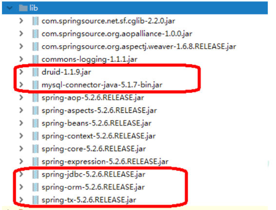
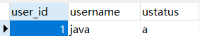

# JdbcTemplate（概念和准备）

## 什么是JdbcTemplate

> Spring框架对JDBC进行封装，使用JdbcTemplate方便实现对数据库操作

## 准备工作

### 引入相关的jar包



```xml
<dependencies>

    <!--单元测试-->
    <!-- https://mvnrepository.com/artifact/junit/junit -->
    <dependency>
        <groupId>junit</groupId>
        <artifactId>junit</artifactId>
        <version>4.12</version>
        <scope>test</scope>
    </dependency>

    <!--spring核心包-->
    <!-- https://mvnrepository.com/artifact/commons-logging/commons-logging -->
    <dependency>
        <groupId>commons-logging</groupId>
        <artifactId>commons-logging</artifactId>
        <version>1.1.1</version>
    </dependency>
    <!-- https://mvnrepository.com/artifact/org.springframework/spring-context -->
    <dependency>
        <groupId>org.springframework</groupId>
        <artifactId>spring-context</artifactId>
        <version>5.2.8.RELEASE</version>
    </dependency>
    <!-- https://mvnrepository.com/artifact/org.springframework/spring-core -->
    <dependency>
        <groupId>org.springframework</groupId>
        <artifactId>spring-core</artifactId>
        <version>5.2.8.RELEASE</version>
    </dependency>
    <!-- https://mvnrepository.com/artifact/org.springframework/spring-beans -->
    <dependency>
        <groupId>org.springframework</groupId>
        <artifactId>spring-beans</artifactId>
        <version>5.2.8.RELEASE</version>
    </dependency>
    <!-- https://mvnrepository.com/artifact/org.springframework/spring-expression -->
    <dependency>
        <groupId>org.springframework</groupId>
        <artifactId>spring-expression</artifactId>
        <version>5.2.8.RELEASE</version>
    </dependency>

    <!--Spring框架一般都是基于AspectJ实现AOP操作-->
    <!-- https://mvnrepository.com/artifact/org.springframework/spring-aspects -->
    <dependency>
        <groupId>org.springframework</groupId>
        <artifactId>spring-aspects</artifactId>
        <version>5.2.8.RELEASE</version>
    </dependency>
    <!--JdbcTemplate操作依赖的包，事务好像也是包含在这个里面的-->
    <!-- https://mvnrepository.com/artifact/org.springframework/spring-jdbc -->
    <dependency>
        <groupId>org.springframework</groupId>
        <artifactId>spring-jdbc</artifactId>
        <version>5.2.8.RELEASE</version>
    </dependency>


    <!--注解导入的包-->
    <!-- https://mvnrepository.com/artifact/org.springframework/spring-aop -->
    <dependency>
        <groupId>org.springframework</groupId>
        <artifactId>spring-aop</artifactId>
        <version>5.2.8.RELEASE</version>
    </dependency>


    <!--德鲁伊数据库连接池-->
    <!-- https://mvnrepository.com/artifact/com.alibaba/druid -->
    <dependency>
        <groupId>com.alibaba</groupId>
        <artifactId>druid</artifactId>
        <version>1.1.9</version>
    </dependency>
    <!-- https://mvnrepository.com/artifact/mysql/mysql-connector-java -->
    <dependency>
        <groupId>mysql</groupId>
        <artifactId>mysql-connector-java</artifactId>
        <version>5.1.47</version>
    </dependency>


</dependencies>
```


### 在spring配置文件配置数据库连接池

```xml
<!--数据库连接池-->
<bean id="dataSource" class="com.alibaba.druid.pool.DruidDataSource">
    <property name="url" value="jdbc:mysql://localhost:3306/test"></property>
    <property name="username" value="root"></property>
    <property name="password" value="root"></property>
    <property name="driverClassName" value="com.mysql.jdbc.Driver"></property>
</bean>
```


### 配置JdbcTemplate对象，注入DataSource

```xml
<!--JdbcTemplate对象-->
<bean id="jdbcTemplate" class="org.springframework.jdbc.core.JdbcTemplate">
    <!--注入dataSource-->
    <property name="dataSource" ref="dataSource"></property>
</bean>
```


### 创建service类，创建dao类，在dao注入jdbcTemplate对象

#### 配置文件

```xml
<!--开启组件扫描-->
<context:component-scan base-package="com.zh"></context:component-scan>
```


#### Service

```java
@Service
public class BookService {

    // 注入dao
    @Autowired
    private BookDao bookDao;

}
```


#### Dao

```java
@Repository
public class BookDaoImpl implements BookDao {

    // 注入JdbcTemplate对象
    @Autowired
    private JdbcTemplate jdbcTemplate;

}
```

# JdbcTemplate操作数据库（添加）

## 对应数据库创建实体类

```java
public class Book {
    private String userId;
    private String username;
    private String ustatus;

    public String getUserId() {
        return userId;
    }

    public void setUserId(String userId) {
        this.userId = userId;
    }

    public String getUsername() {
        return username;
    }

    public void setUsername(String username) {
        this.username = username;
    }

    public String getUstatus() {
        return ustatus;
    }

    public void setUstatus(String ustatus) {
        this.ustatus = ustatus;
    }
}
```


## 编写service和dao

1. 在dao进行数据添加操作
2. 调用JdbcTemplate对象里面update方法实现添加操作
   1. 
   2. 有两个参数
   3. 第一个参数：sql语句
   4. 第二个参数：可变参数，设置sql语句值

```java
@Repository
public class BookDaoImpl implements BookDao {

    // 注入JdbcTemplate对象
    @Autowired
    private JdbcTemplate jdbcTemplate;

    public void add(Book book) {
        // 1. 创建sql语句
        String sql = "insert into t_book values(?, ?, ?)";
        // 2. 调用方法实现
        Object[] args = {book.getUserId(), book.getUsername(), book.getUstatus()};
        int update = jdbcTemplate.update(sql, args);
        System.out.println(update);
    }
}
```


## 测试类

```java
@org.junit.Test
public void testJdbcTemplate() {
    ApplicationContext context = new ClassPathXmlApplicationContext("bean1.xml");
    BookService bookService = context.getBean("bookService", BookService.class);
    Book book = new Book();
    book.setUserId("1");
    book.setUsername("java");
    book.setUstatus("a");
    bookService.addBook(book);
}
```



# JdbcTemplate操作数据库（修改和删除）

## 修改

```java
public void updateBook(Book book) {
    String sql = "update t_book set username = ?, ustatus = ? where user_id = ?";
    Object[] args = {book.getUsername(), book.getUstatus(), book.getUserId()};
    int update = jdbcTemplate.update(sql, args);
    System.out.println(update);
}
```


## 删除

```java
public void deleteBook(String id) {
    String sql = "delete from t_book where user_id = ?";
    int update = jdbcTemplate.update(sql, id);
    System.out.println(update);
}
```

# JdbcTemplate操作数据库（查询返回某个值）

1. 查询表里面有多少条记录，返回是某个值
2. 使用JdbcTemplate实现查询返回某个值代码
   1. 
   2. 有两个参数
   3. 第一个参数：sql语句
   4. 第二个参数：返回类型Class

```java
@Override
public int selectBook() {
    String sql = "select count(*) from t_book";
    Integer count = jdbcTemplate.queryForObject(sql, Integer.class);
    return count;
}
```


# JdbcTemplate操作数据库（查询返回对象）

1. 场景：查询图书详情
2. JdbcTemplate实现传返回对象
   1. 
   2. 有三个参数
   3. 第一个参数：sql语句
   4. 第二个参数：RowMapper是接口，针对返回不同类型数据，使用这个接口里卖弄实现类完成数据封装
   5. 第三个参数：sql语句值

```java
@Override
public Book findBookInfo(String id) {
    String sql = "select * from t_book where user_id = ?";
    Book book = jdbcTemplate.queryForObject(sql, new BeanPropertyRowMapper<Book>(Book.class), id);
    return book;
}
```


# JdbcTemplate操作数据库（查询返回集合）

1. 场景：查询图书列表分页
2. 调用JdbcTemplate方法实现查询返回集合
   1.  
   2. 有三个参数
   3. 第一个参数：sql语句
   4. 第二个参数：RowMapper是接口，针对返回不同类型数据，使用这个接口里面实现类完成数据封装
   5. 第三个集合：sql语句值

```java
@Override
public List<Book> findAllBook() {
    String sql = "select * from t_book";
    List<Book> query = jdbcTemplate.query(sql, new BeanPropertyRowMapper<Book>(Book.class));
    return query;
}
```

# JdbcTemplate操作数据库（批量操作）

## 批量操作：操作表里面多条记录


## JdbcTemplate实现批量添加数据


1. 有两个参数
2. 第一个参数：sql语句
3. 第二个参数：List集合，添加多条数据记录

```java
@Override
public void batchAddBook(List<Object[]> batchArgs) {
    String sql = "insert into t_book value(?, ?, ?)";
    int[] ints = jdbcTemplate.batchUpdate(sql, batchArgs);
    System.out.println(Arrays.toString(ints));
}
```

```java
// 批量添加测试
List<Object[]> batchArgs = new ArrayList<>();
Object[] o1 = {"4", "java", "b"};
Object[] o2 = {"5", "java", "c"};
Object[] o3 = {"6", "java", "d"};
batchArgs.add(o1);
batchArgs.add(o2);
batchArgs.add(o3);
bookService.batchAddBook(batchArgs);
```


## JdbcTemplate实现批量修改操作

```java
@Override
public void batchUpdateBook(List<Object[]> batchArgs) {
    String sql = "update t_book set username = ?, ustatus = ? where user_id = ?";
    int[] ints = jdbcTemplate.batchUpdate(sql, batchArgs);
    System.out.println(Arrays.toString(ints));
}
```

```java
List<Object[]> batchArgs = new ArrayList<>();
Object[] o1 = {"java0909", "b1", "4"};
Object[] o2 = {"java0909", "c1", "5"};
Object[] o3 = {"java0909", "d1", "6"};
batchArgs.add(o1);
batchArgs.add(o2);
batchArgs.add(o3);
bookService.batchUpdateBook(batchArgs);
```


## JdbcTemplate实现批量删除数据

```java
@Override
public void batchDeleteBook(List<Object[]> batchArgs) {
    String sql = "delete from t_book where user_id = ?";
    int[] ints = jdbcTemplate.batchUpdate(sql, batchArgs);
    System.out.println(Arrays.toString(ints));
}
```

```java
List<Object[]> batchArgs = new ArrayList<>();
Object[] o1 = {"3"};
Object[] o2 = {"4"};
batchArgs.add(o1);
batchArgs.add(o2);
bookService.batchDeleteBook(batchArgs);
```

