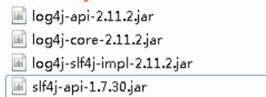
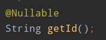
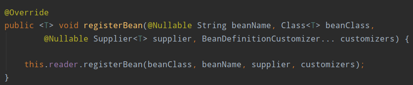
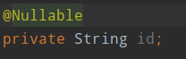

# Spring5框架新功能

## 整个Spring5框架的代码基于Java8，运行时兼容JDK9，许多不建议使用的类和方法在代码库中删除


## Spring5.0框架自带了通用的日志封装

1. Spring5已经移除Log4jCOnfigListener，官方建议使用Log4j2

2. Spring5框架整合Log4j2

   + 第一步，引入jar包

   + ```xml
     <!--引入这个实现包，就可以到入其他的依赖-->
     <!--log4j2-->
     <!-- https://mvnrepository.com/artifact/org.apache.logging.log4j/log4j-slf4j-impl -->
     <dependency>
         <groupId>org.apache.logging.log4j</groupId>
         <artifactId>log4j-slf4j-impl</artifactId>
         <version>2.11.1</version>
         <scope>test</scope>
     </dependency>
     ```

   + 

   + 第二步，创建log4j2.xml配置文件

   + ```xml
     <?xml version="1.0" encoding="UTF-8" ?>
     <!--日志级别以及优先级排序：OFF > FATAL > ERROR > WARE > INFO > DEBUG > TRACE > ALL-->
     <!--Configuration后面的status用于设置log4j2自身内部的信息输出，可以不设置，但设置成trace时，可以看到log4j2内部各种详细输出-->
     <configration status="INFO">
         <!--先定义所有的appender-->
         <appenders>
             <!--输出日志信息到控制台-->
             <console name="Console" target="SYSTEM_OUT">
                 <!--控制日志输出的格式-->
                 <PatternLayout pattern="%d{yyyy-MM-dd HH:mm.SSS} [%t] %-5level %logger[36] - %msg%n"/>
             </console>
         </appenders>
         <!--然后定义logger，只有定义了logger并引入appender，appender才会生效-->
         <!--root：用于制定项目的跟日志，如果没有单独指定Logger，则会使用root作为默认的日志输出-->
         <logers>
             <root level="info">
                 <appender-ref ref="Console" />
             </root>
         </logers>
     </configration>
     ```


## Spring5框架核心容器支持**@Nullable**注解

1. @Nullable注解可以使用在方法上面，属性上面，参数上面，表示方法可以为空，属性值可以为空，参数值可以为空
2. 注解用在方法上面，方法返回值可以为空
   1. 
3. 注解使用在方法参数里面，方法的参数可以为空
   1. 
4. 注解使用在属性上面，属性值可以为空
   1. 


## Spring5核心容器支持函数式风格GenericApplicationContext

```java
// 函数式风格
@org.junit.Test
public void testGenericApplicationContext() {
    // 1. 创建GenericApplicationContext对象
    GenericApplicationContext context = new GenericApplicationContext();
    // 2. 调用context的方法对象注册
    context.refresh();
    context.registerBean("user1",User.class, ()-> new User());

    // 3. 获取在Spring中注册的对象
    User user = (User) context.getBean("user1");
    System.out.println(user);
}
```


## Spring5支持整合Junit5

### 整合Junit4

1. 第一步，引入Spring相关针对测试依赖

   1. ```xml
      <!--Spring单元测试框架-->
      <!-- https://mvnrepository.com/artifact/org.springframework/spring-test -->
      <dependency>
          <groupId>org.springframework</groupId>
          <artifactId>spring-test</artifactId>
          <version>5.2.8.RELEASE</version>
          <scope>test</scope>
      </dependency>
      ```

      

2. 第二步，创建测试类，使用注解的方式完成

   1. ```java
      @RunWith(SpringJUnit4ClassRunner.class) // 加载单元测试框架
      @ContextConfiguration("classpath:bean1.xml") // 加载配置文件
      public class JTest4 {
      
          @Autowired
          private UserService userService;
      
          @Test
          public void test1() {
              userService.accountMoney();
          }
      
      }
      ```


### Spring5整合Junti5

1. 第一步，引入Junit5的jar包

   1. ```java
      <!--Junit5.3-->
      <!-- https://mvnrepository.com/artifact/org.junit.jupiter/junit-jupiter-api -->
      <dependency>
          <groupId>org.junit.jupiter</groupId>
          <artifactId>junit-jupiter-api</artifactId>
          <version>5.3.2</version>
          <scope>test</scope>
      </dependency>
      ```

      

2. 第二步，创建测试类，使用注解完成

   1. ```java
      @ExtendWith(SpringExtension.class)
      @ContextConfiguration("classpath:bean1.xml")
      public class JTest5 {
      
          @Autowired
          private UserService userService;
      
          @Test
          public void test1() {
              userService.accountMoney();
          }
      
      }
      ```

      

3. 使用一个符合注解替代上面两个注解完成整合

   1. ```java
      @SpringJUnitConfig(locations = "classpath:bean1.xml")
      public class JTest5 {
      
          @Autowired
          private UserService userService;
      
          @Test
          public void test1() {
              userService.accountMoney();
          }
      
      }
      ```

      


# Spring框架新功能介绍（Webflux）

## SpringWebflux介绍

1. SpringWebflux是Spring5添加新的模块，用于web开发的，功能和SpringMVC类似的，Webflux使用当年前一种比较流程响应式编程出现的框架
2. 使用传统web框架，比如SpringMVC ，这些基于Servlet容器，Webflux是一种异步非阻塞的框架，异步非阻塞的框架在Servlet3.1以后才支持，核心是基于Reactor的相关API实现的。
3. 解释什么是异步非阻塞
   + 异步和同步
   + 非阻塞和阻塞
   + 上面都是针对对象不一样
   + 异步和同步针对调用者，调用者发送请求，如果等待对方回应之后才去做其他的事情就是同步，如果发送请求之后不等着对方回应就去做其他事情就是异步。
   + 阻塞和非阻塞针对被调用者，被调用者收到请求之后，佐娃请求任务之后才会给出反馈就是阻塞，收到请求之后马上给出反馈然后再去做事情就是非阻塞
4. Webflux特点
   1. 第一，非阻塞式，在有限资源下，提高系统吞吐量和伸缩性，以Reactor为基础实现响应式编程
   2. 第二，函数是编程：Spring5框架基于java8，Webflux使用Java8函数是编程方式实现路由请求
5. 比较SpringMVC
   1. 第一，两个框架都可以使用注解，都晕习惯在tomcat等容器中
   2. 第二，SpringMVC采用命令式编程，Webflux采用异步响应式编程


## 响应式编程（java实现）

### 什么是响应式编程

响应式编程是一种面向数据流和变化传播的编程范式。这意味着可以在编程语言中很方便地表达静态或动态地数据流，而相关地计算模型会自动将变化地值通过数据流进行传播。电子表格程序就是一个响应式编程地一个例子。单元格可以包含字面值或者类似“=B1+C1”地公式，而包含公式地单元格的值会依据其他单元格的值的变化而变化。


## Webflux执行流程和核心API


## SpringWebflux（基于注解编程模型）


## SpringWebflux（基于函数式编程模型）


 