> # 1.Spring框架概述
>
> # 2.IOC 容器
>
> 1. IOC底层原理
> 2. IOC接口（BeanFactory）
> 3. IOC操作Bean管理（基于xml）
> 4. IOC操作Bean管理（基于注解）
>
> # 3.AOP
>
> # 4.JdbcTemplate
>
> # 5.事务管理


# Spring框架概述

1. Spring是个轻量级的开源的JavaEE框架。
2. Spring可以解决企业应用开发的复杂性。
3. Spring有两大核心部分**IOC**、**AOP**。
   1. **IOC**：控制反转，把创建对象的过程交给Spring进行管理。
   2. **AOP**：面向切面，不修改源代码进行功能增强。

4. Spring框架的特点：
   1. 方便解耦（IOC降低解耦，简化开发），简化开发。
   2. AOP编程支持。
   3. 方便程序的测试。
   4. 方便和其他框架一起整合。
   5. 降低API开发难度
   6. 方便进行事务操作

# Spring5下载

1. 使用Spring5.2.8新版本[http://spring.io](http://spring.io)
   + GA标识稳定版本

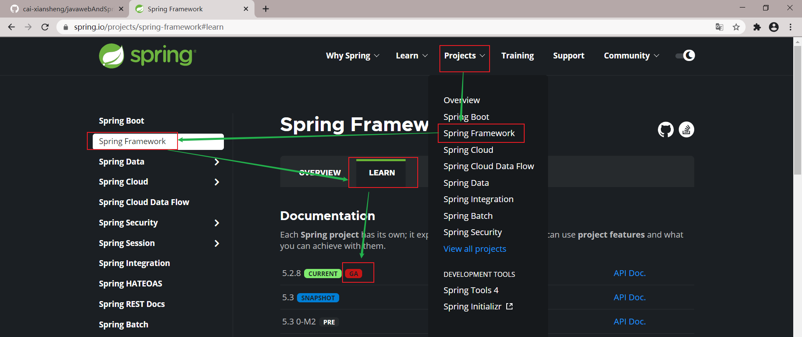

2. 下载地址

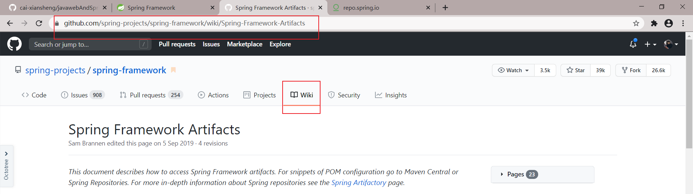

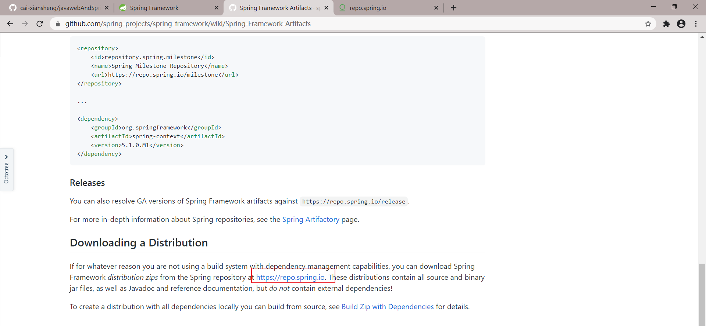

通过这个地址进去下载稳定版本 https://repo.spring.io/release/org/springframework/spring/ 

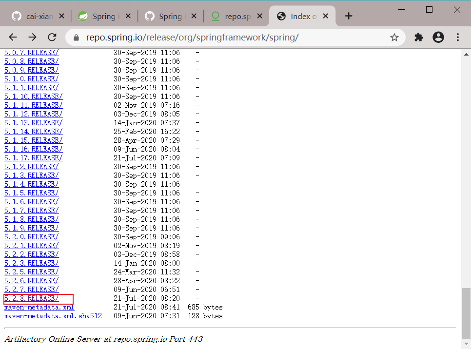

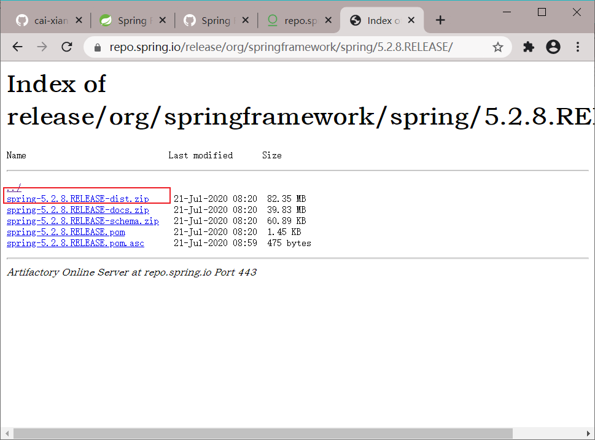

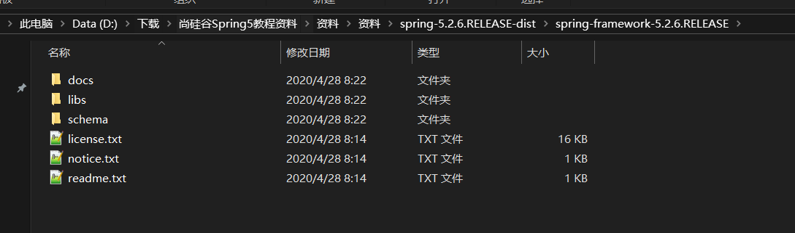

# 入门案例

1. 建立项目

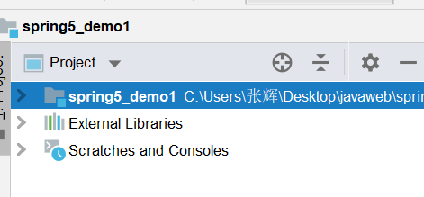

2. 导入相关jar包

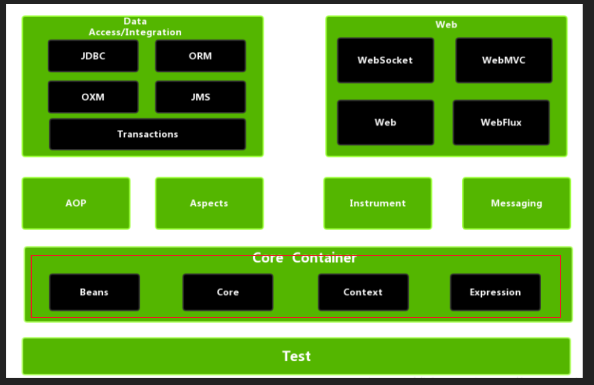

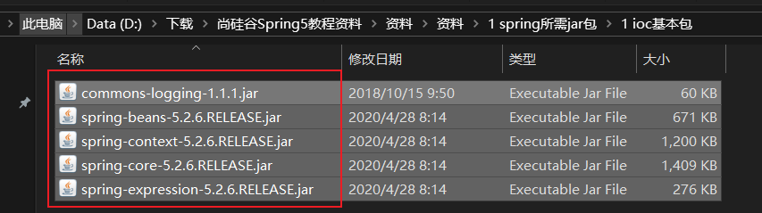

3. 创建普通类，创建普通方法

```java
public class User {
    public void add() {
        System.out.println("add......");
    }
}
```

4. 创建Spring配置文件没在配置文件配置创建的对象

   1. Spring配置文件使用xml文件格式

   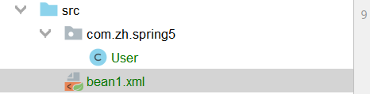

   ```xml
   <?xml version="1.0" encoding="UTF-8"?>
   <beans xmlns="http://www.springframework.org/schema/beans"
          xmlns:xsi="http://www.w3.org/2001/XMLSchema-instance"
          xsi:schemaLocation="http://www.springframework.org/schema/beans http://www.springframework.org/schema/beans/spring-beans.xsd">
   
       <!--配置User对象创建-->
       <bean id="user" class="com.zh.spring5.User"></bean>
   
   </beans>
   ```

5. 进行测试代码编写

```java
public class TestSpring5 {

    @Test
    public void testAdd() {
        // 1. 加载Spring配置文件
        ApplicationContext context = new ClassPathXmlApplicationContext("bean1.xml");


        // 2. 获取配置创建的对象
        User user = context.getBean("user", User.class);

        System.out.println(user);
        user.add();

    }
}
```

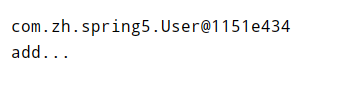


