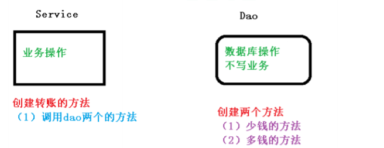
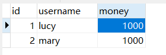
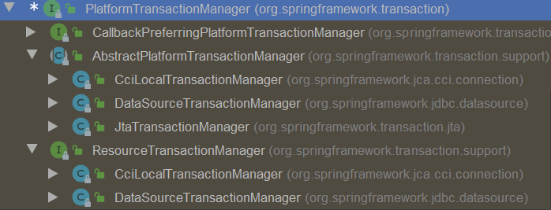
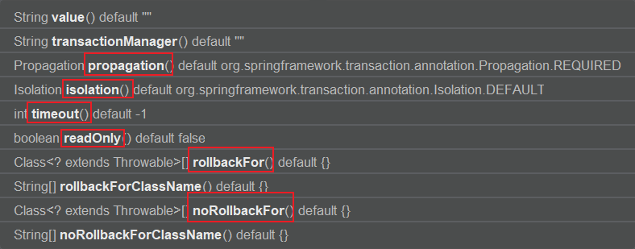
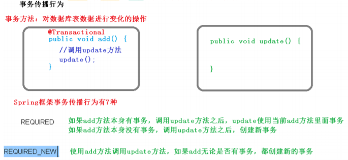

# 事务操作（事务概念）

## 什么是事务

1. 事务时数据库操作最基本单元，逻辑上一组操作，要么都成功。如果有一个失败所有操作都失败。
2. 典型场景：银行转账
   + lucy转账100员给mary
   + lucy少了100，mary多了100

## 事务四个特性（ACID）

1. 原子性：过程不可分割，要么都成功，要么不成功
2. 一致性：操作之前和操作之后的总量是不变的
3. 隔离性：在多事物操作的时候不会产生影响
4. 持久性：事务提交之后，数据发生变化


# 事务操作（搭建事务操作环境）



## 创建数据库表，添加记录



## 创建service，搭建dao，完成对象创建和注入关系

> service注入dao，在dao注入JdbcTemplate，在JdbcTemplate注入DataSource

```java
@Service
public class UserService {

    // 注入dao
    @Autowired
    private UserDao userDao;

}

@Repository
public class UserDaoImpl implements UserDao{

    @Autowired
    private JdbcTemplate jdbcTemplate;

}
```

## 在dao创建两个方法：多钱和少钱的方法，在service创建方法（转账的方法）

```java
@Repository
public class UserDaoImpl implements UserDao{

    @Autowired
    private JdbcTemplate jdbcTemplate;

    public void reduceMoney() {
        String sql = "update t_account set money = money - ? where username = ?";
        jdbcTemplate.update(sql, 100, "lucy");
    }

    public void addMoney() {
        String sql = "update t_account set money = money + ? where username = ?";
        jdbcTemplate.update(sql,100, "mary");
    }
}


@Service
public class UserService {

    // 注入dao
    @Autowired
    private UserDao userDao;

    public void accountMoney() {
        userDao.reduceMoney();
        userDao.addMoney();
    }

}
```

## 上面代码，如果正常执行没有问题的，但是如果代执行过程种出现异常，有问题

```java
public void accountMoney() {
    userDao.reduceMoney();

    int i = 10 / 0;

    userDao.addMoney();
}
```

### 上面的问题如何解决

+ 使用事务进行解决

### 事务操作过程

```java
public void accountMoney() {

    try {
        // 第一步，开启事务

        // 第二步，进行业务操作

        userDao.reduceMoney();

        // 模拟异常
        int i = 10 / 0;

        userDao.addMoney();

        // 第三步，没有发生异常，提交事务

    } catch (Exception e) {
        // 第四步，如果出现了异常，事务回滚

        e.printStackTrace();
    }
}
```

# 事务操作（Spring事务管理介绍）

1. 事务添加到JavaEE三层结构里面的Service层（业务逻辑层）
2. 在spring进行事务管理操作
   1. 有两种方法：编程时事务管理和**声明式事务管理**（使用）
3. 声明式事务管理
   1. 基于注解方式（使用）
   2. 基于xml配置文件形式
4. 在spring及逆行声明式事务管理，底层使用AOP原理
5. Spring事务管理API
   1. 提供了一个接口，代表事务管理器，这个接口针对不同的框架提供了不同的实现类




# 事务操作（注解声明式事务管理）

## 在Spring配置文件配置事务管理器

```xml
<!--创建事务管理器-->
<bean id="transactionManager" class="org.springframework.jdbc.datasource.DataSourceTransactionManager">
    <!--注入数据源-->
    <property name="dataSource" ref="dataSource"></property>
</bean>
```


## 在Spring配置文件，开启事务注解

### 在Spring配置文件引入名称空间tx

```xml
<beans xmlns="http://www.springframework.org/schema/beans"
       xmlns:xsi="http://www.w3.org/2001/XMLSchema-instance"
       xmlns:context="http://www.springframework.org/schema/context"
       xmlns:tx="http://www.springframework.org/schema/tx"
       xsi:schemaLocation="http://www.springframework.org/schema/beans http://www.springframework.org/schema/beans/spring-beans.xsd
                            http://www.springframework.org/schema/context http://www.springframework.org/schema/context/spring-context.xsd
                            http://www.springframework.org/schema/tx http://www.springframework.org/schema/tx/spring-tx.xsd">
```


### 开启事务注解

```xml
<!--开启事务注解-->
<tx:annotation-driven transaction-manager="transactionManager"></tx:annotation-driven>
```


## 在service类上面（或者service类里面方法上面）添加事务注解

1. @Transactional，这个注解添加到类上面，也可以添加到方法上面
2. 如果把这个注解添加到类上面，这个类里面所有的方法都添加事务
3. 如果把这个注解添加方法上面，为这个方法添加事务

```java
@Service
@Transactional
public class UserService {
```

# 事务操作（声明式事务管理参数配置）

## 在service类上面添加注解@Transactional，在这个注解里面可以配置事务相关参数




## propagation：事务传播行为

### 多事物方法进行调用，这个过程中事务是如何进行管理的




```java
@Service
@Transactional(propagation = Propagation.REQUIRED)
public class UserService {
```


## ioslation：事务隔离级别

1. 事务有特性称为隔离性，多事物之间不会产生影响。不考虑隔离性产生很多问题
2. 有三个读问题：脏读、不可重复读、虚（幻）读
3. 脏读：一个未提交事务读取到另一个未提交事务的数据
4. 不可重复读：一个未提交事务读取到另一个提交事务修改数据
5. 虚读：一个未提交事务读取到另一个提交事务添加数据
6. 解决：通过设置事务隔离级别，解决读问题

|                              | 脏读 | 不可重复读 | 幻读 |
| ---------------------------- | ---- | ---------- | ---- |
| READ UNCOMMITTED（读未提交） | 有   | 有         | 有   |
| READ COMMITTED（读已提交）   | 无   | 有         | 有   |
| REPEATABLE READ（可重复度）  | 无   | 无         | 有   |
| SERIALIZABLE（串行化）       | 无   | 无         | 无   |

```java
@Service
@Transactional(propagation = Propagation.REQUIRED, isolation = Isolation.REPEATABLE_READ)
public class UserService {
```


## timeout：超时时间

1. 事务需要在一定时间内进行提交，如果不提交进行回滚
2. 默认值是-1(-1不超时)，设置时间以秒单位进行计算


## readOnly：是否只读

1. 读：查询操作，写：添加修改删除操作
2. readOnly默认值为false，表示可以查询，可以添加修改删除操作
3. 设置readOnly值是true，设置成true之后，只能查询

## rollbackFor：回滚

1. 设置出现哪些异常进行事务回滚

## noRollbackFor：不回滚

1. 设置出现哪些异常不进行事务回滚


# 事务操作（XML声明式事务管理）

> 在Spring配置文件中进行配置

第一步，配置事务管理器

第二步，配置通知

第三步，配置切入点和切面

```xml
<!-- 1. 创建事务管理器-->
<bean id="transactionManager" class="org.springframework.jdbc.datasource.DataSourceTransactionManager">
    <!--注入数据源-->
    <property name="dataSource" ref="dataSource"></property>
</bean>

<!--开启事务注解-->
<!--<tx:annotation-driven transaction-manager="transactionManager"></tx:annotation-driven>-->


<!-- 2. 配置通知-->
<tx:advice id="txAdvice">
    <!--配置事务参数-->
    <tx:attributes>
        <!--指定在哪种规则的方法上添加事务-->
        <tx:method name="accountMoney" propagation="REQUIRED"/>
        <!--<tx:method name="account*"></tx:method>-->
    </tx:attributes>
</tx:advice>

<!-- 3. 配置切入点和切面-->
<aop:config>
    <!--配置切入点-->
    <aop:pointcut id="pt" expression="execution(* com.zh.spring5.service.UserService.*(..))"/>
    <!--配置切面-->
    <aop:advisor advice-ref="txAdvice" pointcut-ref="pt"/>
</aop:config>
```

# 事务操作（完全注解声明式事务管理）

```java
@Configuration // 配置类
@ComponentScan(basePackages = "com.zh.spring5") // 组件扫描
@EnableTransactionManagement // 开启事务
public class TxConfig {

    // 创建数据库连接池
    @Bean
    public DruidDataSource getDruidDataSource() {
        DruidDataSource dataSource = new DruidDataSource();
        dataSource.setDriverClassName("com.mysql.jdbc.Driver");
        dataSource.setUrl("jdbc:mysql://localhost:3306/test?useSSL=false");
        dataSource.setUsername("root");
        dataSource.setPassword("root");
        return dataSource;
    }

    // 创建JdbcTemplate对象
    @Bean
    public JdbcTemplate getJdbcTemplate(DataSource dataSource) {
        // 到ioc容器中根据类型找到dataSource
        JdbcTemplate jdbcTemplate = new JdbcTemplate();
        // 注入dataSource
        jdbcTemplate.setDataSource(dataSource);
        return jdbcTemplate;
    }

    // 创建事务管理器
    @Bean
    public DataSourceTransactionManager getDataSourceTransactionManager(DataSource dataSource) {
        DataSourceTransactionManager transactionManager = new DataSourceTransactionManager();
        transactionManager.setDataSource(dataSource);
        return transactionManager;
    }

}
```


